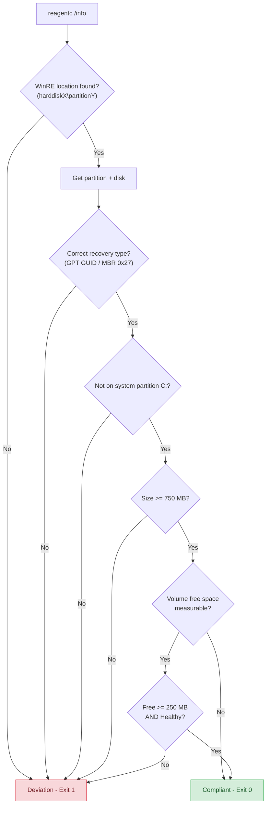
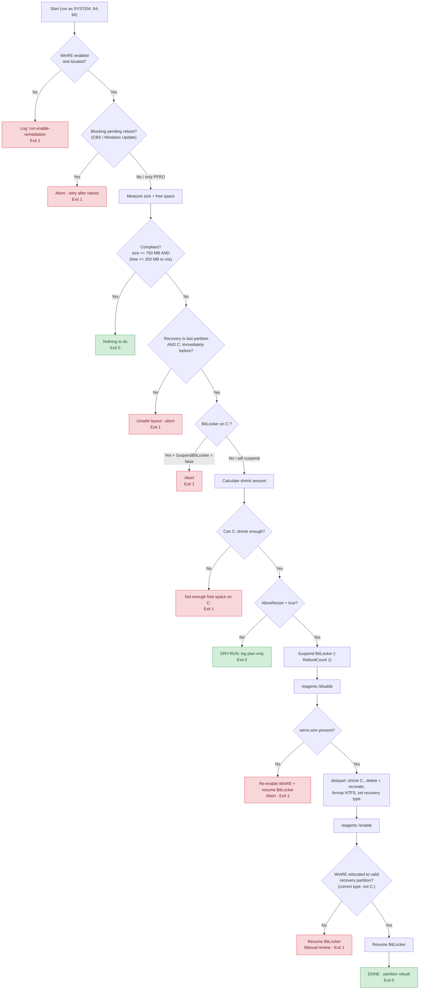

# WinRE Recovery Partition - Intune Proactive Remediation

A pair of PowerShell scripts for Microsoft Intune Proactive Remediations that
detect and (optionally) fix undersized Windows Recovery Environment (WinRE)
partitions on Windows 10/11. The remediation follows Microsoft's
[KB5028997](https://support.microsoft.com/topic/instructions-to-manually-resize-your-partition-to-install-the-winre-update-400faa27-9343-461c-ada9-24c8229763bf)
procedure - the official fix for the well-known KB5034441 (0x80070643)
WinRE update failure.

## Files

| File | Role |
| ---- | ---- |
| `Detect-RecoveryPartition.ps1` | Detection script. Exit 1 = remediate, Exit 0 = compliant. |
| `Remediate-RecoveryPartition.ps1` | Remediation script. Destructively rebuilds the recovery partition. Safe by default (dry-run). |

Both scripts must run as **SYSTEM in 64-bit PowerShell**, which is the default
for Intune Proactive Remediations when "Run script in 64-bit PowerShell" is
enabled.

## What the detection flags

The detection script returns exit code 1 (remediation needed) if any of these
are true:

- WinRE is disabled or has no valid partition location
- The WinRE location is not a partition of type Recovery (GPT GUID
  `de94bba4-06d1-4d40-a16a-bfd50179d6ac` or MBR type `0x27`)
- WinRE is hosted on the system partition (C:) instead of a dedicated one
- The recovery partition is smaller than 750 MB (configurable)
- Free space inside the partition is below 250 MB (configurable)
- The volume health status is not `Healthy`

The thresholds at the top of the script can be tuned to taste.

## What the remediation does

The remediation script implements the KB5028997 procedure:

1. Read the current WinRE location via `reagentc /info`.
2. Run a series of **layout safety checks** (see below). If any fails, the
   script aborts without touching the disk.
3. Optionally suspend BitLocker on C: (`-RebootCount 1` is used as a safety
   net so protection auto-resumes if anything goes wrong).
4. Disable WinRE (`reagentc /disable`) - this stages `winre.wim` back to
   `System32\Recovery`. The script verifies the image exists before
   continuing, otherwise it re-enables WinRE and aborts.
5. Use `diskpart` to:
   - Shrink the OS partition (C:) by the calculated amount
   - Delete the old recovery partition
   - Create a new primary partition that fills the freed space
   - Quick-format it as NTFS with label `Windows RE tools`
   - Set the correct partition type (GPT GUID or MBR `0x27`) and, on GPT,
     the platform-required + no-drive-letter attributes
     (`0x8000000000000001`)
6. Re-enable WinRE (`reagentc /enable`), which copies the image into the new
   partition.
7. Resume BitLocker if it was suspended.
8. Verify the new partition is the correct type and not on C:, otherwise log
   a warning and exit 1.

Before any of this, the script applies the **same compliance test as the
detection script** (large enough AND either enough free space or free space not
measurable) and exits early with "nothing to do" if the partition already
passes. This keeps the two scripts in agreement, so a device is never left
perpetually flagged by detection while remediation declines to act.

A persistent log is written to
`%ProgramData%\IntuneRemediations\WinRE-Resize.log` on every run.

## How it works

### Detection

### Remediation

## Safety model

The remediation is **destructive** (it deletes and recreates a partition), so
it ships with several guard rails. Read these before deploying.

### `$AllowResize = $false` is the default

The shipped value is `$false`. In this mode the script measures, plans, and
logs everything it WOULD do, but makes no changes. **You must flip it to
`$true` to actually resize the disk.** Do this only after:

- Piloting on a representative subset of devices
- Confirming that recovery media or a BitLocker recovery key escrow is in
  place for those devices

### Hard preconditions

If any of these is not met, the script logs the reason and exits 1 with no
changes:

- WinRE is currently enabled and located on a real partition
- No blocking pending reboot. `PendingFileRenameOperations` alone is
  considered harmless and can be ignored via
  `$IgnorePendingFileRename = $true` (the default). CBS, CBS-Packages,
  and Windows Update reboot flags always block.
- The recovery partition is the **last** partition on its disk (this is the
  only layout KB5028997 supports)
- The partition immediately before recovery is the OS partition (C:)
- C: has enough free space to be shrunk by the required amount
- If BitLocker is on, `$SuspendBitLocker = $true` is set (otherwise the
  script refuses to touch the disk)
- `winre.wim` is present in `System32\Recovery` after `reagentc /disable`
  (otherwise the script re-enables WinRE and aborts so the machine is never
  left without a recovery image)

### Tunables

| Variable | Default | Purpose |
| --- | --- | --- |
| `$AllowResize` | `$false` | **Master switch.** Must be `$true` for any disk change to happen. |
| `$SuspendBitLocker` | `$true` | Suspend BitLocker on C: with `-RebootCount 1` during the operation. |
| `$MinPartitionSizeMB` | `750` | Below this the partition is rebuilt. Keep in sync with the detection script's threshold. |
| `$TargetPartitionSizeMB` | `1024` | Grow the recovery partition to at least this size. |
| `$TargetFreeMB` | `250` | Desired free space inside the recovery partition after rebuild. |
| `$IgnorePendingFileRename` | `$true` | Treat `PendingFileRenameOperations` as non-blocking. |
| `$LogPath` | `%ProgramData%\IntuneRemediations\WinRE-Resize.log` | Where to log. |

## Deploying via Intune

1. **Intune admin center** -> *Devices* -> *Scripts and remediations* ->
   *Create script package*.
2. Detection script: `Detect-RecoveryPartition.ps1`. Remediation script:
   `Remediate-RecoveryPartition.ps1`.
3. Settings:
   - Run this script using the logged-on credentials: **No**
   - Enforce script signature check: **No** (unless you sign the scripts)
   - Run script in 64-bit PowerShell: **Yes**
4. Assign to a **small pilot group** first.
5. Watch the per-device output in Intune and the
   `%ProgramData%\IntuneRemediations\WinRE-Resize.log` on a few of the pilot
   machines. Confirm the dry-run plans look correct.
6. Edit the remediation script to set `$AllowResize = $true` and re-upload
   to the same script package.
7. Re-assign to the same pilot group and verify a handful of real rebuilds
   complete successfully (look for `DONE:` log lines and check the new
   partition size).
8. Roll out gradually to broader rings.

## Exit codes

| Script | Exit 0 | Exit 1 |
| --- | --- | --- |
| Detection | Compliant | Deviation detected, remediation should run |
| Remediation | Rebuilt OK, dry-run completed, or nothing to do | Aborted (unsafe layout/conditions) or error |

## What this does NOT do

- Does **not** enable WinRE if it is currently disabled (the script aborts
  with a message pointing to a separate enable-remediation). The detection
  script will still flag the device as non-compliant so you can target it
  with another remediation.
- Does **not** support layouts where the recovery partition is not the last
  partition on the disk. Microsoft's KB5028997 procedure does not cover that
  case either.
- Does **not** handle dynamic disks or storage spaces.
- Does **not** attempt to extend the partition in place. Windows cannot
  extend a recovery partition that has unallocated space on only one side
  if there are other partitions in the way - delete-and-recreate is the only
  reliable path.

## References

- Microsoft Support, [KB5028997 - Instructions to manually resize your
  partition to install the WinRE update](https://support.microsoft.com/topic/instructions-to-manually-resize-your-partition-to-install-the-winre-update-400faa27-9343-461c-ada9-24c8229763bf)
- Microsoft Support, [KB5034441 - Security update for Windows Recovery
  Environment](https://support.microsoft.com/topic/kb5034441-windows-recovery-environment-update-for-windows-10-version-21h2-and-22h2-january-9-2024-62c04204-aaa5-4fee-a02a-2fdea17075a8)

## License

Provided as-is, no warranty. Test thoroughly in a pilot ring before broad
deployment.
